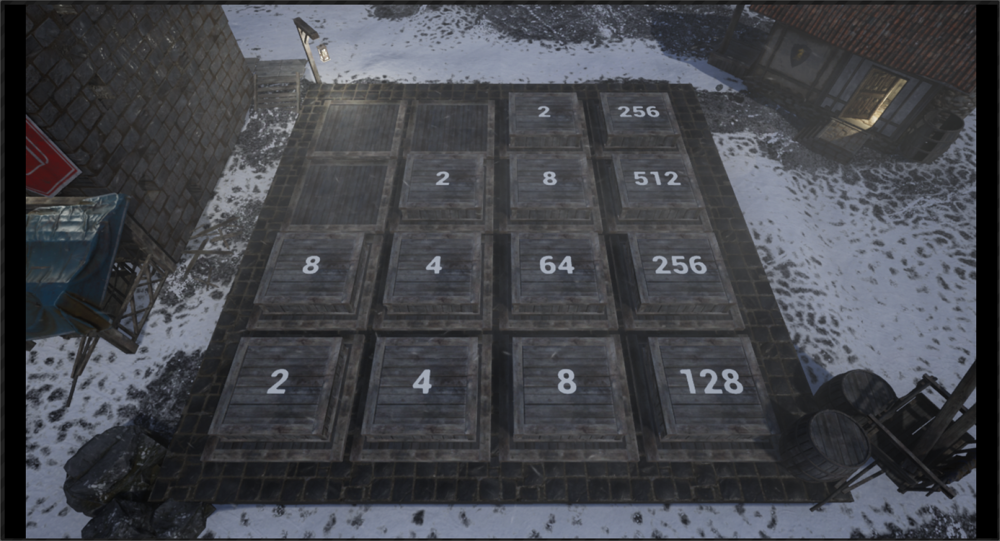

# Another2048

Another2048 is my own implementation of the [original 2048 game](http://2048game.com/) but with a slight twist. Said twist being that it's all built in the Unreal Engine 4. I've made it a personal goal of mine to relearn C++ and master UE4 over the summer of 2019. I've gone through quite a few tutorials on the engine and now I wish to create something on my own that feels fully fleshed out, polished, and like a real game that one would find on platforms such as Steam or GOG. I thought about it carefully and decided that my first solo project with UE4 would be creating my own version of 2048.

### Progress
Currently, Another2048 is a work in progress. In it's current state, the game works as it should and it looks pretty decent to boot. It still needs some polish but it's coming along well. A playable version will be up soon for download along with a web version if possible.

### WIP Screenshot

